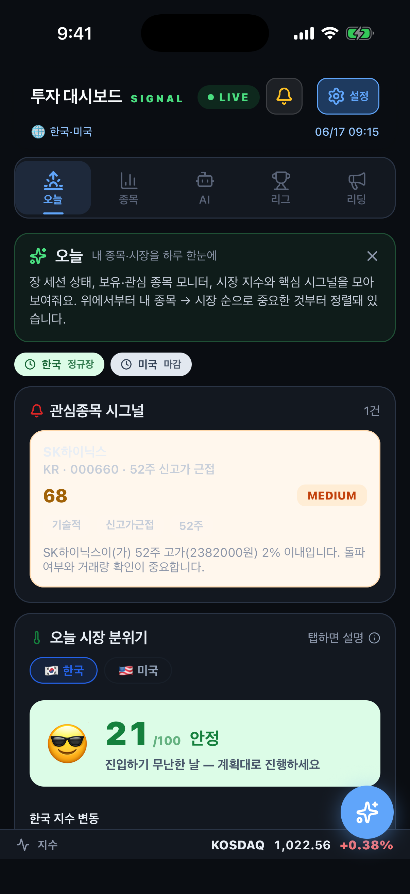
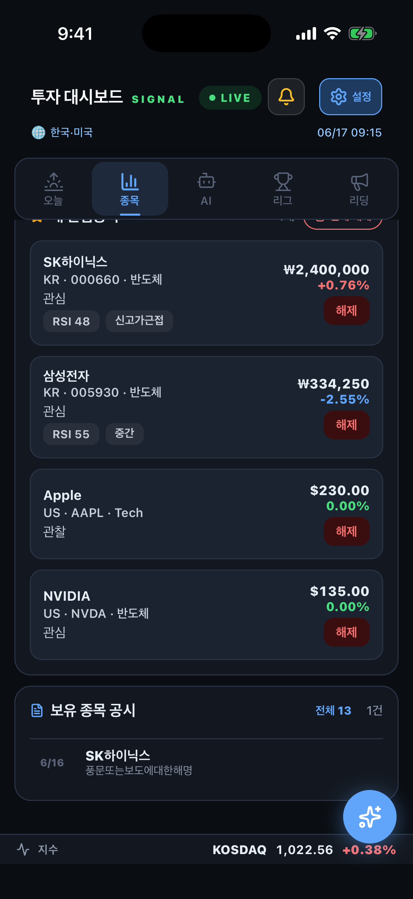
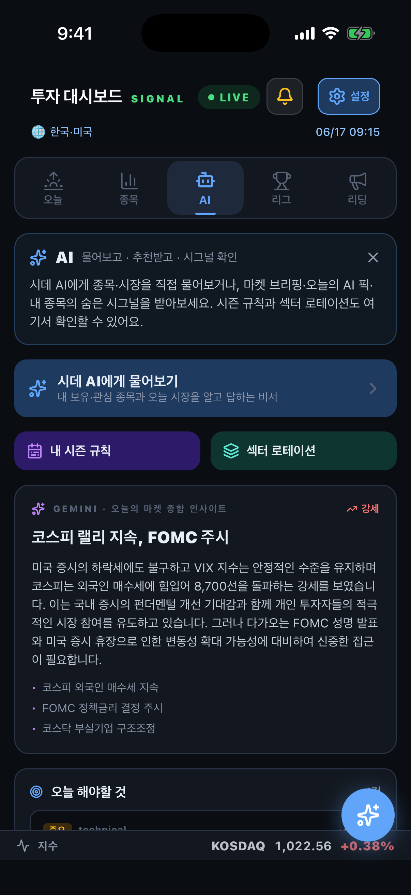
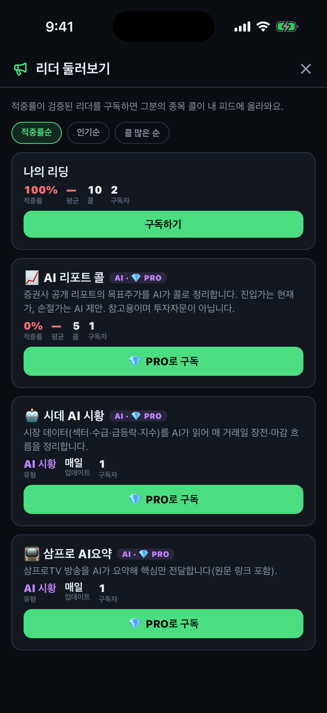
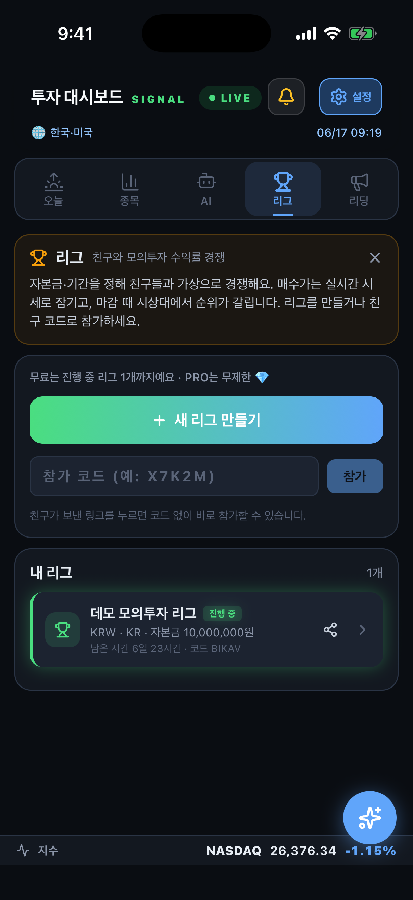

# 시데 (SignalDesk) — 개인 투자 대시보드

> 시장·종목·단타 시그널을 한 화면에서. AI 비서, 검증된 콜 구독(리딩), 친구와 모의투자 리그까지.
> **단일 코드베이스(Expo)로 iOS · Android · Web 동시 운영**, 백엔드는 Kotlin + Spring Boot.

<p>
  <a href="https://giwon1130.github.io/signal-desk-app/"><b>🌐 웹 데모 바로가기</b></a> ·
  📱 iOS TestFlight 베타 운영 중 ·
  🤖 AI 요약 = Google Gemini
</p>

---

## 📸 스크린샷

| 오늘 (브리프·위험도) | 종목 (관심·실시간 손익) | 시데 AI (마켓 인사이트) |
|:---:|:---:|:---:|
|  |  |  |
| **리딩 (리더 마켓·AI 리더)** | **리그 (모의투자)** | |
|  |  | |

> 모바일(iOS 시뮬레이터) 캡쳐. 데스크톱 웹 화면은 [라이브 데모](https://giwon1130.github.io/signal-desk-app/)에서 바로 확인할 수 있어요.
> 추가 캡쳐 방법은 [docs/screenshots/CAPTURE.md](docs/screenshots/CAPTURE.md) 참고.

---

## 한눈에

**시데**는 흩어져 있는 투자 정보(시장 지표·내 종목·뉴스·공시·단타 시그널)와 AI 분석, 그리고 사람·AI의 매매 콜을 **하나의 대시보드**로 모은 개인 투자 도구입니다.

- 아침에 **모닝 브리프 한 장**으로 간밤 미국장·수급·뉴스·오늘 셋업을 파악
- 관심·보유 종목의 **실시간 손익**을 한눈에 (KR 실시간 WebSocket)
- 모르는 건 **시데 AI**에게 바로 질문, 종목은 **심층 리포트**로 깊게
- 검증된 리더의 **콜을 구독**하고(진입가 자동 박제 + 적중률 추적), **AI 리더**의 시황·리포트 콜도 받기
- 친구들과 **모의투자 리그**로 같은 시드에서 수익률 경쟁

---

## 핵심 기능

### 🌅 오늘 (Today)
- **AI 브리프** — 장전·장중·마감 시점에 미국장 + 수급 + 섹터 + 뉴스를 Gemini가 종합한 시황 한 장
- **합성 위험도** — VIX·뉴스·대안지표를 1~10으로 종합한 시장 리스크 게이지
- 한국/미국 **세션 상태**(장중/장마감/조기폐장 반영), 휴장·주말 자동 전환
- 보유/관심 종목 **공시(DART)** 실시간 알림

### 📊 종목
- 관심종목 / 실제 보유(매수가·수량 → 실시간 손익·평가금)
- **실시간 시세** — 한국 종목 WebSocket 5초 틱, 정렬 가능한 테이블
- 종목 검색(국내·미국), 종목 상세(차트·지표·알림 설정)

### 🤖 시데 AI
- Gemini 기반 **투자 비서** — 시장·종목·전략을 대화로 질문 (FREE 하루 10회 / PRO 100회)
- **종목 심층 리포트** — 한 종목을 깊게 분석한 리포트 생성(PRO)
- 답변은 보유·관심 종목 컨텍스트를 반영, 매수/매도 단정 없이 근거 중심

### 📣 리딩 — 콜 구독
- **사람 리더**: 종목을 콜하면 **진입가가 자동 박제**되고 이후 수익률·**적중률**이 정직하게 추적됨. 코드로 구독
- **AI 리더 (PRO 전용)**: 🤖 시데 AI 시황(흐름) · 📺 방송 AI요약 · 📈 증권사 리포트 목표가 콜 — 스케줄러가 자동 발행
- 콜 적중 시 "거봐 내가 말했지?" 푸시, 적중률·평균수익으로 리더 검증

### 🏆 리그 — 모의투자
- 친구와 같은 시드로 시즌 생성/참가(코드), **실시간 시세 평가 리더보드**
- 거래 수수료·종목 집중도(최대 비중) 규칙, 장중 거래 시간 가드, 종료 시 자동 정산

### 🔔 알림 & PRO
- 급등락·목표가/손절·공시·콜 적중 **푸시 + 딥링크**(탭하면 해당 화면으로), 방해금지 시간대
- **PRO**: AI 쿼터 확대 · 고급 알림 · AI 리더 구독 · 종목 심층 리포트 (현재 베타 무료/수동 승인)

---

## 🛠 기술 스택

| 영역 | 스택 |
|---|---|
| 앱 | Expo · React Native (iOS · Android · Web 단일 코드, `Platform.OS` 분기로 웹 전용 데스크톱 레이아웃) · TypeScript |
| 실시간 | WebSocket(시세 틱) · Expo Push(알림) · 딥링크 라우팅 |
| 백엔드 | Kotlin · Spring Boot · PostgreSQL(Flyway 마이그레이션) · Caffeine 캐시 · JdbcTemplate |
| AI | Google Gemini (키 로테이션 · 모델 폴백 · 일일 쿼터) |
| 데이터 | 네이버/야후 시세 · FRED 매크로 · DART/SEC 공시 · Google News · 증권사 리포트 컨센서스 |
| 인프라 | Railway(API) · GitHub Pages(웹, GitHub Actions 자동 배포) · EAS **로컬 빌드로 iOS 배포 비용 $0** |

## 🧱 아키텍처 (요약)

```
[Expo 앱 (iOS/Android/Web)]
   │  REST + WebSocket + Expo Push
   ▼
[Spring Boot API (Railway)]
   ├─ 시장/종목/차트   ├─ AI 비서·리포트(Gemini)
   ├─ 리딩(콜·적중률)  ├─ 리그(거래·정산)
   ├─ 알림(푸시·딥링크) └─ 스케줄러(브리프·공시·AI 리더·정산)
   ▼
[PostgreSQL]  +  외부: 네이버·야후·FRED·DART·SEC·Gemini
```

## ✨ 개발 하이라이트

- **단일 코드베이스 멀티플랫폼** — 모바일은 빠른 확인용 컴패니언, 웹은 정보 밀도 높은 데스크톱 3열 셸(티커 리본 + 좌 네비 + 메인 + 우 컨텍스트 + Cmd+K 팔레트)로 같은 백엔드 공유
- **$0 iOS 배포** — EAS 로컬 빌드 + 자동 제출로 클라우드 빌드 비용 없이 TestFlight 운영
- **정직한 성과 추적** — 콜 진입가/결착가를 박제(immutable)해 적중률·수익률을 사후 조작 불가능하게 기록
- **무료 한도 내 AI 운영** — Gemini 키 로테이션·모델 폴백·일일 쿼터·캐시로 비용 최소화

## 🔗 링크
- 웹 데모: https://giwon1130.github.io/signal-desk-app/
- 개발 문서: [`docs/`](docs/) · 백엔드: `../signal-desk-api`

> ⚠️ 본 서비스의 모든 분석·시그널은 참고용이며 투자자문이 아닙니다. 투자 판단과 책임은 본인에게 있습니다.
